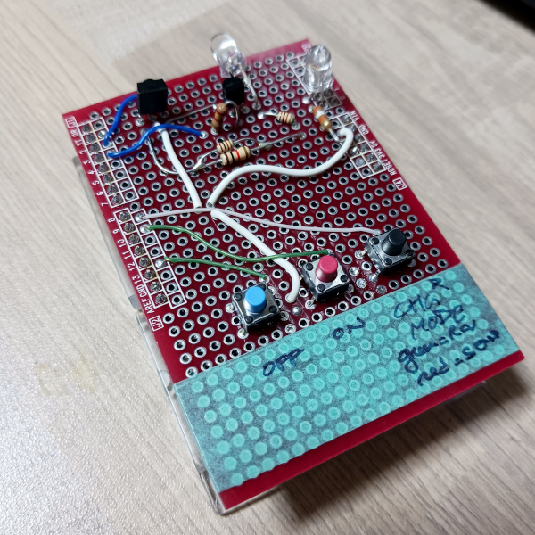

# IR Remote Cloner

A command line application to capture, store, and manage IR remote control codes using a serial-connected device (like an Arduino with IR receiver).



## Functionalities

- [x] Receive fixed IR codes from most standard formats (NEC) 
- [x] Debug mode view output
- [x] Save/read codes
- [x] Generate sample Arduino code for fixed codes remote clone
- [x] Send dynamically previously recorded IR code via arduino
- [ ] Receive variable IR codes (ie: air conditionner)
- [ ] Analyze variable codes
- [ ] Generate sample Arduino code for variable codes remote clone

## Technical Features

- **SQLite Database Storage**: Stores remotes and their key codes in a local SQLite database
- **Serial Communication**: Connects to devices via serial port to receive IR codes
- **Remote Management**: Create and list IR remotes with descriptions
- **Key Registration**: Capture IR codes and associate them with labeled keys
- **Minimal Dependencies**: Uses standard Python libraries where possible


## Installation

1. Clone this repository
2. Install the required dependency:
   ```bash
   pip install -r requirements.txt
   ```

## Usage

Run the application:
```bash
python app.py
```

### Menu Options

1. **Create a New Remote**: Register a new remote control device with name and optional comment
2. **List Remotes**: Display all registered remotes in a table format
3. **Register New Keys**: Capture IR codes for a specific remote
4. **View Registered Keys**: Display all captured IR codes for a selected remote
5. **Read Serial Data (Debug)**: Debug mode to view raw serial data from the connected device
6. **Generate Arduino Code**: Generate Arduino code for transmitting the captured IR codes


### Serial Device Format

The application expects serial data in the format:
```
protocol;code1;code2
```

For example:
```
8;213;234
3;875;123
```

### Database Schema

The application creates two tables:

- **Remote**: Stores remote information (id, name, comment)
- **Key**: Stores individual key codes (id, remote_id, protocol, code1, code2, key_name, comment)

## Hardware Requirements

- Serial device (e.g., Arduino with IR receiver) that sends IR codes in the expected format
- Default serial port: `/dev/ttyACM1` (configurable during key registration) 
  - Override with `-p </dev/whatever>`
- Default baud rate: 115200
  - Override with `-b <baudrate>`

## Controls

- During key registration, press **ESC** to exit the registration loop
- Use **Ctrl+C** to quit the application at any time

## Error Handling

- The application gracefully handles missing pyserial installation
- Invalid serial ports are handled with warnings
- Database integrity is maintained with unique constraints
- Input validation prevents empty or invalid entries

# Electronics

## Arduino code

In the folder `arduino\`:
* **ir-remote-receiver** : just the receiver code to use with the python main program
* **ir-remote-sender** : send sample IR codes linked to the 3 buttons
* **ir-remote-multimode** : combo of both above, with one button dedicated to switch modes

